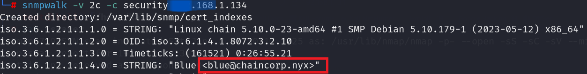

- Sirve para gestionar dispositivos en redes IP.
- SNMP se comunica a través de protocolo UDP

- Si lanzamos nmap solo podremos ver el puerto 80 en la maquina victima que estamos utilizando.

- Vamos a escanear por puerto UDP.
	- Es un protocolo de transporte sin conexión.

```
nmap -sU --top-ports 200 --min-rate 5000 -n -Pn (IP_VICTIMA) 
```


- Podemos ver que tenemos uno con servicio snmp.
- Vamos a utilizar 2 herramientas para enumerar este protocolo:

==onesixtyone==
- Herramienta de escaneo rápido para el protocolo SNMP.
- Descubrir y probar nombres de comunidades SNMP (Vamos a utilizar diccionarios)

```
onesixtyone -c /usr/share/wordlists/rockyou.txt (IP_VICTIMA)
```


- Como podemos ver, nos da la clave de comunidad ==security==
- Ahora vamos a utilizar la herramienta snmpwalk.

==snmpwalk==
- Herramienta que sirve para consultar dispositivos de red que utilizan el protocolo SNMP.
- Obtener información detallada sobre la configuración y el estado de los dispositivos en la red.

```
snmpwalk -v 2c -c (CLAVE_DE_COMUNIDAD) (IP_VICTIMA)
```
- -v 2c --> es la versión.



- Encontramos un dominio.
- Podemos encontrar:
	- Usuario.
	- Correo.
	- Dominio.
	- Contraseña.
- Vamos a añadir este domino en la carpeta /etc/host.


- Ya estamos dentro de la pagina.
- Ahora vamos a ver si la pagina tiene subdominios con ==wfuzz==

```
wfuzz -c --hc=404 -w /usr/share/wordlists/seclists/Discovery/DNS/subdomains-top1million-110000.txt -H "Host: FUZZ.(DOMINIO) -u (IP_VICTIMA)"
```


- Tenemos un sub dominio llamado ==utils==
- Lo agregamos en el fichero /etc/hosts, quedaría ==utils.chaincorp.nyx==


- Ya estamos dentro del sub-dominio.